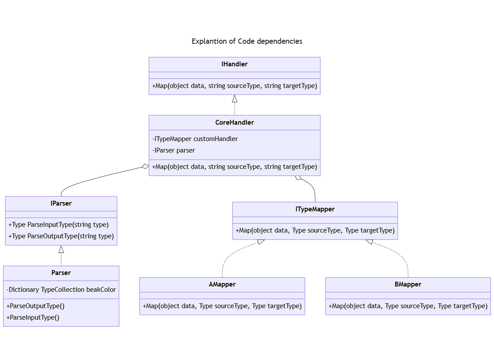

## Project description

Diagrams bellow shows code structure

There were 2 main architecture decisions taken
- Parser class
  - is responsible for bridging between types names as strings to real type. It does encapsulation of configuration part of logic and creates flexibility of decisions i.e. whether to parse type income type A to type outcome type C or type D or any other, also allows fallback soultions. This configuration keeps ITypeMapper clean from this functionality and lets it focus on pure mapping
- ITypeMapper interface with different implementations i.e AMapper, BMapper and further
  - this step allows to make open architecture for future extensions as f.e. CMapper can be added without causing braking changes. And as we have Parser, which prepares mapping from strings to Types, custom Mapper (like AMapper, BMapper) can focus on mapping itself (Single Responsibility Principle)
 
### Architecture Trade-offs
- It was assumed that input types as well output types are know at static type (mock classes like Types.InnerDataModel.Reservation and Types.OuterDataModel.Room were created). However if they are not know, then architecture can be changed: a new implementation IParser interface can be created as well as new implementation of ITypeMapper interface.
- In order to create this architecture extensible, new interfaces were created which lead to increase of solution size itself, however long turn this is correct approach as it allows the architecture to be extensible.
- As all new classes implement interface, all new functionality is testable, because it is always possible to mock class which has an interface as a parent
- In order to avoid repeating the error handling code in ITypeMapper' implementations, it was decided to have error handling centrally in CoreHandler class. This decision has disadvantage that the class has many catch statements for different exception types
    
